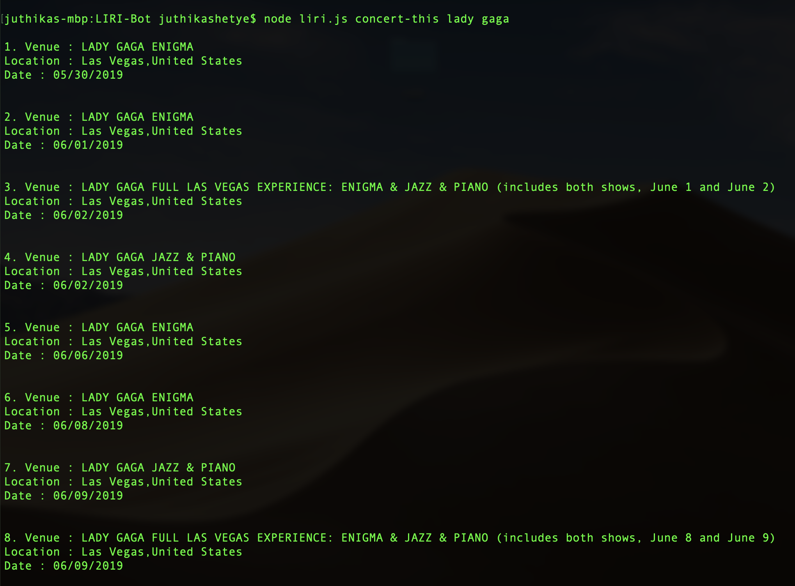
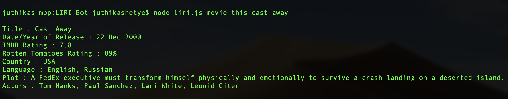
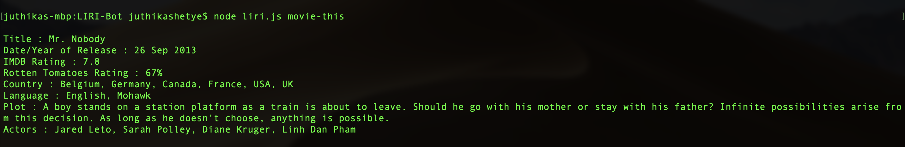
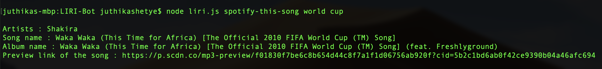
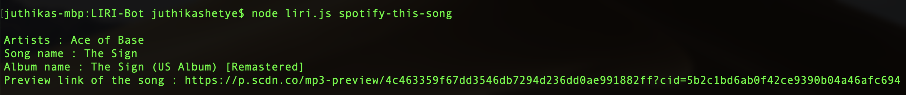
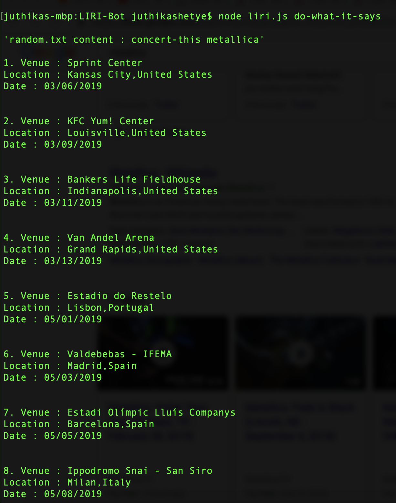
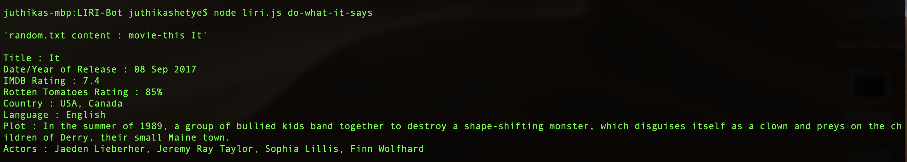
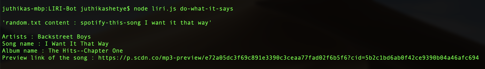

# LIRI-Bot

* LIRI is like iPhone's SIRI. However, while SIRI is a Speech Interpretation and Recognition Interface, LIRI is a Language Interpretation and Recognition Interface. LIRI is a command line node app that takes in parameters and gives you back data.

* LIRI will search Spotify for songs, Bands in Town for concerts, and OMDB for movies.

## Working of App

* Click this [Youtube video](https://youtu.be/D8zWhHRtxO4) for a demo of the working of this app.

## Things to do before you start using the app

* To retrieve the data that will power this app, you'll need to install the following Node packages in the root folder where you saved all the other files for this app. Without installing these packages, the app won't work on your computer.

	* [Node-Spotify-API](https://www.npmjs.com/package/node-spotify-api)

		* `npm install --save node-spotify-api`

	* [Axios](https://www.npmjs.com/package/axios)

		* `npm install axios`

	* [Moment](https://www.npmjs.com/package/moment)

		* `npm i moment`

	* [DotEnv](https://www.npmjs.com/package/dotenv)

		* `npm install dotenv`

* Visit [Spotify](https://developer.spotify.com/my-applications/#!/) to get your own spotify API keys.

* Next, create a file named `.env`, add the following to it, replacing the values with your API keys (no quotes):

	* Spotify API keys

		* `SPOTIFY_ID=your-spotify-id`
		* `SPOTIFY_SECRET=your-spotify-secret`

## Instructions to use the app

* In your terminal/command line navigate to the folder where `liri.js` is saved and type the following:

#### To get a list of shows for an artist/band, type this :

* node liri.js concert-this artist/band name

	* eg: `node liri.js concert-this lady gaga`

	

#### To get info about a movie, type this :

* node liri.js movie-this movie name

	* eg 1: `node liri.js movie-this Cast Away`

	

	* eg 2: `node liri.js movie-this` (when name of movie is not provided)

	

#### To get info about a song, type this :

* node liri.js spotify-this-song song name

	* eg 1: `node liri.js spotify-this-song World Cup`

	

	* eg 2: `node liri.js spotify-this-song` (when name of song is not provided)

	

#### To get info of whatever is written in `random.txt`, type this :

* `node liri.js do-what-it-says`

	* This command will give info about a song, artist shows or movie as per the `random.txt` contents.
	* You can edit `random.txt` to put your own parameters.

	When `random.txt` has `concert-this,"metallica"`
	

	When `random.txt` has `movie-this,"it"`
	

	When `random.txt` has `spotify-this-song,"I want it that way"`
	

